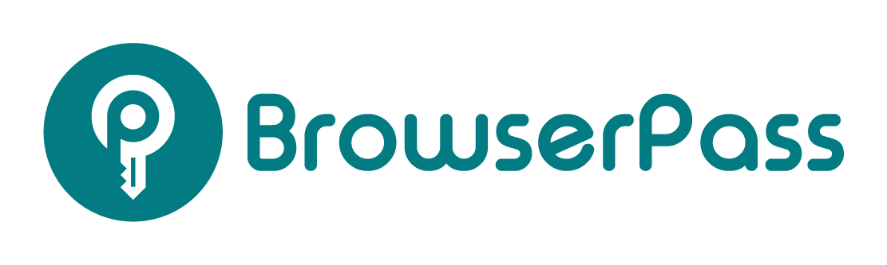

<p align="center"></p>

# Browserpass - browser extension

Browserpass is a browser extension for [zx2c4's pass](https://www.passwordstore.org/), a UNIX based password store manager. It allows you to auto-fill or copy to clipboard credentials for the current domain, protecting you from phishing attacks.

In order to use Browserpass you must also install a [companion native messaging host](https://github.com/browserpass/browserpass-native), which provides an interface to your password store.


## Table of Contents

-   [Requirements](#requirements)
-   [Installation](#installation)
    -   [Verifying authenticity of the Github releases](#verifying-authenticity-of-the-github-releases)
-   [Updates](#updates)
-   [Usage](#usage)
    -   [Organizing password store](#organizing-password-store)
    -   [First steps in browser extension](#first-steps-in-browser-extension)
    -   [Available keyboard shortcuts](#available-keyboard-shortcuts)
    -   [Password matching and sorting](#password-matching-and-sorting)
    -   [OpenID authentication](#openid-authentication)
    -   [Modal HTTP authentication](#modal-http-authentication)
    -   [Password store locations](password-store-locations)
-   [Options](#options)
-   [Usage metadata](#usage-metadata)
-   [Security](#security)
-   [Privacy](#privacy)
-   [Requested permissions](#requested-permissions)
-   [FAQ](#faq)
    -   [How to use the same username and password pair on multiple domains](#how-to-use-the-same-username-and-password-pair-on-multiple-domains)
    -   [Why is OTP not supported?](#why-is-otp-not-supported)
    -   [Hints for macOS users](#hints-for-macos-users)
    -   [Hints for NixOS / Nix users](#hints-for-nixos--nix-users)
-   [Contributing](#contributing)

## Requirements

-   The latest stable version of Chromium or Firefox, or any of their derivatives.
-   The latest stable version of gpg (having `pass` or `gopass` is actually not required).
-   A password store that follows certain [naming conventions](#organizing-password-store)

## Installation

In order to install Browserpass correctly, you have to install two of its components:

-   [Native messaging host](https://github.com/browserpass/browserpass-native#installation)
-   Browser extension for Chromium-based browsers (choose one of the options):
    -   Install using a package manager for your OS (which will provide auto-update and keep extension in sync with native host app):
        -   Arch Linux: [browserpass-chromium](https://www.archlinux.org/packages/community/any/browserpass-chromium/), [browserpass-chrome](https://aur.archlinux.org/packages/browserpass-chrome/)
    -   Install the extension from [Chrome Web Store](https://chrome.google.com/webstore/detail/browserpass-ce/naepdomgkenhinolocfifgehidddafch) (which will provide auto-updates)
    -   Download `browserpass-webstore.crx` from the latest release and drag'n'drop it into `chrome://extensions`
        -   This extension has the same ID as the one in Chrome Web Store, so when a new version will appear in Web Store, it will auto-update! Use if you want to be on latest and greatest version.
    -   Download `browserpass-github.crx` from the latest release and drag'n'drop it into `chrome://extensions`
        -   This extension has a different ID comparing to the one in Chrome Web Store, so you will not receive any auto-updates! Use for creating distro packages, or if you simply don't tolerate being forced to update when a new version is released.
    -   Download `browserpass-chromium.zip`, unarchive and use `Load unpacked extension` in `chrome://extensions` in Developer mode.
-   Browser extension for Firefox-based browsers (choose one of the options):
    -   Install using a package manager for your OS (which will provide auto-update and keep extension in sync with native host app):
        -   Arch Linux: [browserpass-firefox](https://www.archlinux.org/packages/community/any/browserpass-firefox/)
    -   Install the extension from [Firefox Add-ons](https://addons.mozilla.org/en-US/firefox/addon/browserpass-ce/) (which will provide auto-updates)
    -   Download `browserpass-firefox.zip` from the latest release, unarchive and use `Load Temporary Add-on` on `about:debugging#addons` (remember the extension will be removed after browser is closed!).

### Verifying authenticity of the Github releases

All release files are signed with a PGP key that is available on [maximbaz.com](https://maximbaz.com/), [keybase.io](https://keybase.io/maximbaz) and various OpenPGP key servers. First, import the public key using any of these commands:

```
$ curl https://maximbaz.com/pgp_keys.asc | gpg --import
$ curl https://keybase.io/maximbaz/pgp_keys.asc | gpg --import
$ gpg --recv-keys EB4F9E5A60D32232BB52150C12C87A28FEAC6B20
```

To verify the signature of a given file, use `$ gpg --verify <file>.asc`.

It should report:

```
gpg: Signature made ...
gpg:                using RSA key 8053EB88879A68CB4873D32B011FDC52DA839335
gpg: Good signature from "Maxim Baz <...>"
gpg:                 aka ...
Primary key fingerprint: EB4F 9E5A 60D3 2232 BB52  150C 12C8 7A28 FEAC 6B20
     Subkey fingerprint: 8053 EB88 879A 68CB 4873  D32B 011F DC52 DA83 9335
```

## Updates

If you installed the extension from a webstore, you will receive updates automatically.

If not, repeat the installation instructions for the extension.

**IMPORTANT:** Majority of the improvements require changing code in both browser extensions and the [host application](https://github.com/browserpass/browserpass-native#updates). It is expected that you will make sure to keep both components up to date.

## Usage

### Organizing password store

Browserpass was designed with an assumption that certain conventions are being followed when organizing your password store.

1. In order to benefit of phishing attack protection, a password entry file, or any of its parent folders, must contain a full domain name (including TLD like `.com`) in their name in order to automatically match a website. However, entries which do not contain such a domain in their name may still be manually selected.

    Some good examples:

    ```
    ~/.password-store/
        accounts.google.com.gpg
        amazon.com.gpg
        github.com/
            personal.gpg
            work.gpg
    ```

1. Password must be defined on a line starting with `password:`, `pass:` or `secret:` (case-insensitive), and if all of these are absent, the first line in the password entry file is considered to be a password.

1. Username must be defined on a line starting with `login:`, `username:`, or `user:` (case-insensitive), and if all of these are absent, default username as configured in browser extension or in `.browserpass.json` of specific password store, and finally if everything is absent the file name is considered to be a username.

1. OpenID URL must be defined on a line starting with `openid:` (case-insensitive).

1. URL ([only](#password-matching-and-sorting) used for [modal HTTP authentication](#modal-http-authentication)!) must be defined on a line starting with `url:`, `uri:`, `website:`, `site:`, `link:` or `launch:` (case-insensitive).

### First steps in browser extension

Click on the icon or use <kbd>Ctrl+Shift+L</kbd> to open Browserpass with the entries that match current domain.

How to change the shortcut:

-   Chromium: `chrome://extensions/shortcuts`
-   Firefox: `about:addons` > Gear icon > `Manage Extension Shortcuts`

When Browserpass shows entries for a specific domain, you will see a badge with the domain name in the search input field:


If you want to intentionally disable phishing attack protection and search the entire password store for credentials, you must press <kbd>Backspace</kbd> to confirm this decision (domain badge will disappear), then use Browserpass normally.

### Available keyboard shortcuts

Note: If the cursor is located in the search input field, every shortcut that works on the selected entry will be applied on the first entry in the popup list.

| Shortcult                                            | Action                                          |
| ---------------------------------------------------- | ----------------------------------------------- |
| <kbd>Ctrl+Shift+L</kbd>                              | Open Browserpass popup                          |
| <kbd>Enter</kbd>                                     | Submit form with currently selected credentials |
| Arrow keys and <kbd>Tab</kbd> / <kbd>Shift+Tab</kbd> | Navigate popup list                             |
| <kbd>Ctrl+C</kbd>                                    | Copy password to clipboard                      |
| <kbd>Ctrl+Shift+C</kbd>                              | Copy username to clipboard                      |
| <kbd>Ctrl+G</kbd>                                    | Open URL in the current tab                     |
| <kbd>Ctrl+Shift+G</kbd>                              | Open URL in the new tab                         |
| <kbd>Backspace</kbd> (with no search text entered)   | Search passwords in the entire password store   |

### Password matching and sorting

When you first open Browserpass popup, you will see a badge with the current domain name in the search input field:


This means that phishing attack prevention is enabled, and Browserpass is only showing you entries from your password store that match this domain.

In order for Browserpass to correctly determine matching entries, it is expected that your password store follows naming conventions (see [Organizing password store](#organizing-password-store)). In particular your file or folder name must contain a domain with a valid TLD, i.e. not `github.gpg`, but `github.com.gpg`. If an attacker directed you to `https://github.co/login` (notice `.co`), Browserpass will **not** present `github.com` entry in the popup. However if you intentionally want to re-use the same credentials on multiple domains (e.g. `amazon.com` and `amazon.co.uk`), see [How to use the same username and password pair on multiple domains](#how-to-use-the-same-username-and-password-pair-on-multiple-domains).

Browserpass will display entries for the current domain, as well as all parent entries, but not entries from different subdomains. Suppose you are currently on `https://v3.app.example.com`, Browserpass will present all the following entries in popup (if they exist): `v3.app.example.com`, `app.example.com`, `example.com`; but it will not present entries like `v2.app.example.com` or `wiki.example.com`.

Finally Browserpass will also present entries that you have recently used on this domain, even if they don't actually meet the usual matching requirements. Suppose you have a password for `amazon.com`, but you open `https://amazon.co.uk`, at first Browserpass will present no entries (because nothing matches `amazon.co.uk`), but if you hit <kbd>Backspace</kbd>, find `amazon.com` and use it to login, next time you visit `https://amazon.co.uk` and open Browserpass, `amazon.com` entry will already be present.

The sorting algorithm implemented in Browserpass will use several intuitions to try to order results in the most expected way for a user:

1. If Browserpass was previously used on this domain, the first entry in the list will always be the most recently used one.
1. The rest of the available password entries will be sorted by the frequency of their usage, the more times a password was used, the higher it will be in the list.
1. Password entries with the identical usage counts are sorted by number of domain levels (specificity), i.e. `wiki.example.com` will be above `example.com`.
1. If all the above is equal, password entries are sorted alphabetically.

### OpenID authentication

OpenID is often used when someone doesn't trust (or doesn't want to need to trust) a website with their authentication credentials. For this reason, to prevent leaking credentials Browserpass considers OpenID and username+password authentications mutually exclusive: when `openid:` field is present in a password entry, Browserpass will _only_ attempt to fill the OpenID field in a form, it will not even attempt to fill username and password fields, even if they are also present in the password entry, even if a website contains username and password fields in a login form.

### Modal HTTP authentication

Due to the way browsers are implemented, browser extensions are only able to fill modal credentials (e.g. a popup for basic HTTP auth) for a website if the website in question has been opened by the extension. For this reason alone Browserpass contains functionality to open a URL associated with a password entry in the current or a new browser tab. However, please note that Browserpass is not intended as a bookmark manager.

If you want Browserpass to handle modal authentication, you must open these websites using Browserpass. This will cause Browserpass to open the target site, and transparently intercept and fill the authentication request. You will not normally see a login popup unless the credentials are incorrect.

### Password store locations

Browserpass is able to automatically detect your password store location: it first checks the `$PASSWORD_STORE_DIR` environment variable. If that variable is not defined, it falls back to `$HOME/.password-store`.

Using the `Custom store locations` setting in the browser extension options, you are able to define one or more custom locations for password stores. There are no restrictions on where these may be located; they can be subfolders of the main password store, gopass mounts, or any other folder that contains password entries.

## Options

The list of available options:

| Name                                                            | Description                                                  |
| --------------------------------------------------------------- | ------------------------------------------------------------ |
| Automatically submit forms after filling (aka `autoSubmit`)     | Make Browserpass automatically submit the login form for you |
| Default username (aka `username`)                               | Username to use when it's not defined in the password file   |
| Custom gpg binary (aka `gpgPath`)                               | Path to a custom `gpg` binary to use                         |
| Custom store locations                                          | List of password stores to use                               |
| Custom store locations - badge background color (aka `bgColor`) | Badge background color for a given password store in popup   |
| Custom store locations - badge text color (aka `color`)         | Badge text color for a given password store in popup         |

Browserpass allows configuring certain settings in different places places using the following priority, highest first:

1. Options defined in specific `*.gpg` files, only apply to these password entries:
    - `autoSubmit`
1. Options defined in `.browserpass.json` file located in the root of a password store:
    - `autoSubmit`
    - `gpgPath`
    - `username`
    - `bgColor`
    - `color`
1. Options defined in browser extension options:
    - Automatically submit forms after filling (aka `autoSubmit`)
    - Default username (aka `username`)
    - Custom gpg binary (aka `gpgPath`)
    - Custom store locations
    - Custom store locations - badge background color (aka `bgColor`)
    - Custom store locations - badge text color (aka `color`)

## Usage metadata

Browserpass keeps metadata of recently used credentials in local storage and Indexed DB of the background page. This is first and foremost internal data to make Browserpass function properly, used for example to implement the [Password matching and sorting](#password-matching-and-sorting) algorithm, but nevertheless you might find it useful to explore using your browser's devtools. For example, if you are considering to rotate all passwords that you used in the past month (e.g. if you just found out that you had a malicious app installed for several weeks), you can retrieve such list from Indexed DB quite easily (open an issue if you need help).

For details on how we treat your data and how to remove it, consult [Security](#security) and [Privacy](#privacy) sections.

## Security

Browserpass aims to protect your passwords and computer from malicious or fraudulent websites.

-   To protect against phishing, only passwords matching the origin hostname are suggested or selected without an explicit search term.
-   To minimize attack surface, the website is not allowed to trigger any extension action. Browserpass must be directly invoked by the user.
-   Only data from the selected password entry is made available to the website.
-   Given full control of the non-native component of the extension, an attacker may be able to extract passwords stored in the configured repository, but cannot obtain files elsewhere on the filesystem or execute arbitrary code outside of the browser.
-   Browserpass does not attempt to secure the data it stores in browser local storage, it is assumed that users take precautions to protect their local file system (e.g. by using disk encryption).

## Privacy

Browserpass does not send any telemetry data. All metadata that is collected in order for the extension to function correctly is stored _only_ in local storage, and never leaves your browser.

This data is not synchronized between your computers, and upon removing Browserpass extension all the data will be automatically purged by your browser.

In order to remove all metadata, use "Clear all data" button in the extension options page or do it using your browser's devtools.

## Requested permissions

Browserpass extension requests the following permissions:

| Name                 | Reason                                                                                                                                                                                                                                                                                                                                               |
| -------------------- | ---------------------------------------------------------------------------------------------------------------------------------------------------------------------------------------------------------------------------------------------------------------------------------------------------------------------------------------------------- |
| `debugger`           | Only used for "auto-submit" functionality: if all attepts to locate a "Submit" button failed, Browserpass will put focus inside the login form and issue an <kbd>Enter</kbd> keypress. This is only available in Chromium-based browsers, and sadly this permission [cannot be specified as optional](https://developer.chrome.com/apps/permissions) |
| `activeTab`          | To get URL of the current tab, used for example to determine which passwords to show you by default in the popup                                                                                                                                                                                                                                     |
| `tabs`               | To get URL of a given tab, used for example to set count of the matching passwords for a given tab                                                                                                                                                                                                                                                   |
| `clipboardWrite`     | For "Copy password" and "Copy username" functionality                                                                                                                                                                                                                                                                                                |
| `nativeMessaging`    | To allow communication with the native app                                                                                                                                                                                                                                                                                                           |
| `notifications`      | To show browser notifications on install or update                                                                                                                                                                                                                                                                                                   |
| `webRequest`         | For modal HTTP authentication                                                                                                                                                                                                                                                                                                                        |
| `webRequestBlocking` | For modal HTTP authentication                                                                                                                                                                                                                                                                                                                        |
| `http://*/*`         | To allow using Browserpass on all websites                                                                                                                                                                                                                                                                                                           |
| `https://*/*`        | To allow using Browserpass on all websites                                                                                                                                                                                                                                                                                                           |

## FAQ

### How to use the same username and password pair on multiple domains

There are several ways to tell Browserpass to use the same pair of credentials on multiple domains, for example how to re-use an existing password entry `amazon.com.gpg` on a `https://amazon.co.uk` website without duplicating your credentials in multiple password files.

The first option is just to manually find the desired credentials and use them in Browserpass, in other words if you have credentials for `amazon.com`, but you are currently on `https://amazon.co.uk`, open Browserpass, hit <kbd>Backspace</kbd> to search the entire password store, find `amazon.com` and hit <kbd>Enter</kbd> to login. Next time you will open Browserpass on `https://amazon.co.uk`, the popup will already contain the `amazon.com` entry, because it was previously used on this website (for details see [Password matching and sorting](#password-matching-and-sorting) section).

The second option is to create a symlink file `amazon.co.uk.gpg` pointing to `amazon.com.gpg` in your password store, not only Browserpass, but `pass` itself will both recognize the symlink as an existing password entry. It's also possible to symlink an entire directory, rather than individual files.

If you simply want to re-use the same credentials on multiple subdomains of the same domain (e.g. `app.example.com` and `wiki.example.com`), you can also rename your password entry to a common denominator of the two subdomains, which in this example would be `example.com.gpg` (see [Password matching and sorting](#password-matching-and-sorting)).

### Why is OTP not supported?

Tools like `pass-otp` make it possible to use `pass` for generating OTP codes, however keeping both passwords and OTP URI in the same location diminishes the major benefit that OTP is supposed to provide: two factor authentication. The purpose of multi-factor authentication is to protect your account even when attackers gain access to your password store, but if your OTP seed is stored in the same place, all auth factors will be compromised at once. In particular, Browserpass has access to the entire contents of your password entries, so if it is ever compromised, all your accounts will be at risk, even though you signed up for 2FA.

Browserpass is opinionated, it does not promote `pass-otp` and intentionally does not support generating OTP codes from OTP URIs in password entiries, even though there are other password managers that provide such functionality.

There are valid scenarios for using `pass-otp` (e.g. it gives protection against intercepting your password during transmission), but users are strongly advised to very carefully consider whether `pass-otp` is really an appropriate solution - and if so, come up with their own ways of accessing OTP codes that conforms to their security requirements (for example by using dmenu/rofi scripts). For the majority of people `pass-otp` is not recommended; using any phone app like Authy will be a much better and more secure alternative, because this way attackers would have to not only break into your password store, but they would _also_ have to break into your phone.

Going forward, OTP support will be provided via a [separate extension](https://github.com/browserpass/browserpass-extension/issues/76). That extension will integrate with browserpass to ensure a streamlined workflow - if the OTP extension is installed, it will be automatically triggered when browserpass fills an entry and an OTP token is present.

## Building the extension

### Build locally

Make sure you have the latest stable Yarn installed.

The following `make` goals are available (check Makefile for more details):

| Command              | Description                                                                             |
| -------------------- | --------------------------------------------------------------------------------------- |
| `make` or `make all` | Compile the extension source code, prepare unpacked extensions for Chromium and Firefox |
| `make extension`     | Compile the extension source code                                                       |
| `make chromium`      | Compile the extension source code, prepare unpacked extension for Chromium              |
| `make firefox`       | Compile the extension source code, prepare unpacked extension for Firefox               |
| `make crx`           | Compile the extension source code, prepare packed extension for Chromium                |

### Load an unpacked extension

-   For Chromium:
    -   Go to `chrome://extensions`
    -   Enable `Developer mode`
    -   Click `Load unpacked extension`
    -   Select `browserpass-extension/chromium` directory
-   For Firefox:
    -   Go to `about:debugging#addons`
    -   Click `Load temporary add-on`
    -   Select `browserpass-extension/firefox` directory

## Contributing

1. Fork [the repo](https://github.com/browserpass/browserpass-extension)
2. Create your feature branch
    - `git checkout -b my-new-feature`
3. Commit your changes
    - `git commit -am 'Add some feature'`
4. Push the branch
    - `git push origin my-new-feature`
5. Create a new pull request
